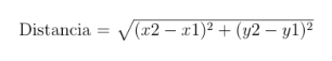

# Loops
## Exercise 1
Realice un programa, que permita leer varios números enteros
hasta que se introduzca el cero.

Luego el programa mostrará lo siguiente:
- La cantidad de números leídos
- La cantidad de números pares
- La cantidad de números de impares

El cero, no debe entrar en el conteo.

## Exercise 5
Desarrolle un programa que permita calcular el perímetro de un polígono, si se sabe el número
de vértices y las coordenadas de cada uno de los vértices.

Considere lo siguiente:
- El número de vértices, es un número mayor o igual a 3 y menor o igual a 10. El programa
debe verificar el ingreso del dato
- El programa irá solicitando el valor de cada vértice e irá calculando el valor de cada lado. Note que para calcular el valor el último lado, debe considerar la última y la primera coordenada ingresada.
- Para hallar la distancia entre dos  coordenadas  puede utilizar la fórmula del teorema de Pitágoras:

