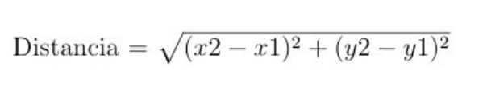
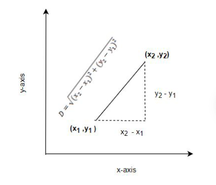

# Programming 2 - UTEC
## Estructuras de control
### Selectivas
##### Exercise 1
Desarrollar un código que lea dos números enteros, identifique si el numero ingresado es par o impar y divida el primero entre el segundo.
Si el número es cero debe señalar que el cociente no está definido

#### Exercise 2
Escribir un programa que permita leer un número entero que podría tener los valores 1, 2, 3 ó 4, e imprima la estación de año que le corresponda según la tabla :

1  Otoño
2  Invierno
3  Primavera
4  Verano
Ahora cambie los enteros por char, con las opciones ‘p’, ‘v’, ‘o’, ‘i’

## Exercises
### Example 3
Tai Loy, ha decidido empaquetar en sus bodegas colores, en cajas  de
6, 12 y 24 unidades. De tal manera que reducirá sus costos al ser ellos
mismos quienes realicen el empaque de colores.

Se pide realizar un programa que capture como dato de entrada un número
entero que representaría la cantidad de colores a ser empaquetados y el
programa halle el menor número de cajas de colores de 24, 12, 6 e indicar
el número de colores sobrantes.

```
Ejemplo 1:
Si se ingresa 104 el programa indicará que se necesitará:
4 cajas de 24 colores
0 cajas de 12 colores
1 caja de 6 colores
2 colores sobrarían.
```
```
Ejemplo 2:
Si se ingresa 498 el programa indicará que se necesitará:
20 cajas de 24 colores
1 cajas de 12 colores
1 caja de 6 colores
0 colores sobrarían.
```

### Example 4
Escriba un código que calcule la distancia entre dos puntos. Los 
puntos tienen las coordenadas (x1,y1) y (y1,y2); y la distancia 
está dada por la fórmula:



## Control Structure Exercises
### Exercise 2
Realice un programa que permita leer un número entero de al menos 3 dígitos,
dato que se debe validar, luego el programa indicará:
- La cantidad total de dígitos
- La cantidad de dígitos pares 
- La cantidad de dígitos impares

```
Execution

Numero: 34
Numero: 4
Numero: 345678325

Numero digitos: 9
Digitos pares: 4
Digitos impares: 5
```

Nota: Falta consultar más de una vez.

### Exercise 3
El valor de PI puede ser aproximadamente la siguiente serie infinita:


Escribir un programa que muestre 60 aproximaciones de PI. La primera 
aproximación debe de usar solo el primer término de la serie infinita
cada aproximación debe incluir un nuevo término.
Observando la lista de aproximaciones podría deducir en qué aproximación
se estabiliza el valor de PI.

### Exercise 4
Cada cuadrado de un tablero de ajedrez puede ser descrito por una combinación 
de una letra un número. Por ejemplo: G5

El siguiente pseudocódigo describe el algoritmo para determinar si un cuadrado 
del tablero de ajedrez es de color blanco o negro, si se da como dato una letra 
y un número.

````
if la letra es A, C, E o G
    if el numero  es impar 
        color = "negro"
    else 
        color = "blanco"
else
    if el numero es par
        color = "negro"
    else
        color = "blanco"
````

Desarrolle un programa en C++ en que lea las coordenadas y el programa indique si 
corresponde a un cuadrado negro o blanco.


### Exercise
Cada denominación monetaria del dólar tiene asociado un personaje con algún tipo 
de relevancia histórica, usualmente presidentes y héroes. Aunque existen 
denominaciones de 500, 1000, 5000 y 10,000 para uso público estas denominaciones 
han sido descontinuadas en 1969. En la tabla se muestra la lista vigente.
Desarrolle un programa que lea la denominación y que muestre el nombre del personaje, 
en el caso de los billetes de 500, 1000, 5000 y 10000 deberá mostrarse el mensaje 
“Denominación descontinuada” en otros valores deberá mostrar “No existe esa denominación”.
